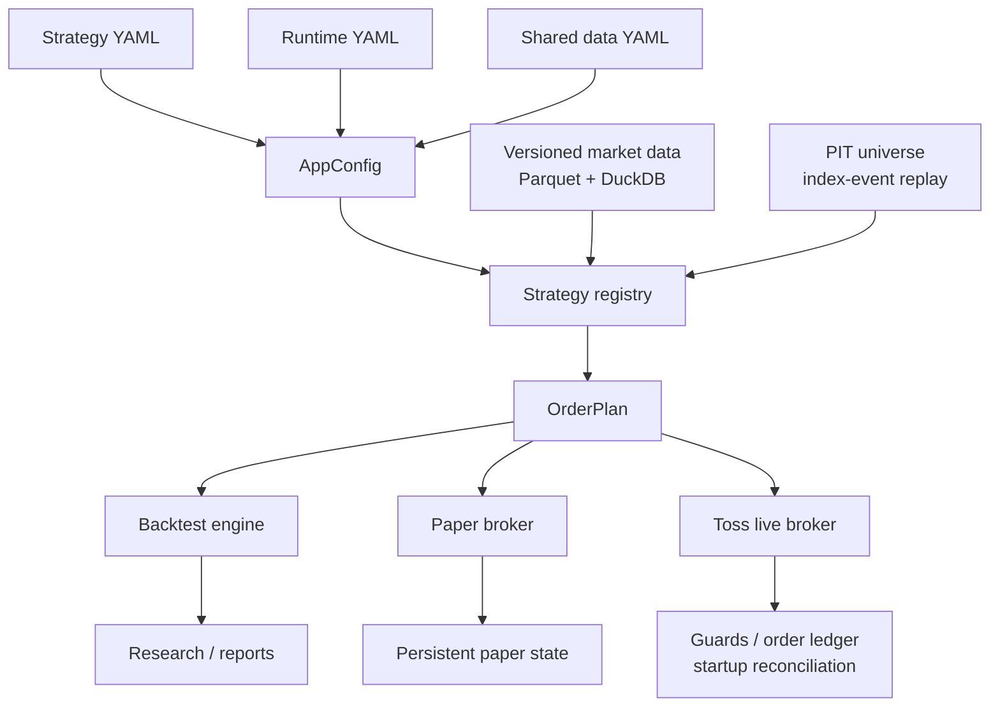

# SuperTrendQuant

> 연구에서 검증한 전략을 다시 구현하지 않고 백테스트, 모의투자, 실거래까지
> 동일한 계약으로 실행하기 위한 미국·한국 주식 퀀트 트레이딩 시스템

SuperTrendQuant는 SuperTrend 기반 매매 아이디어에서 출발한 개인 퀀트 엔지니어링
프로젝트입니다. 현재는 단순한 지표 계산을 넘어 전략 연구, 시점 기준(Point-in-Time)
종목 유니버스, 버전형 시장 데이터, 기업행동 처리, 백테스트, 모의투자, 실거래와
운영 안전장치를 하나의 Python 패키지로 통합합니다.

이 프로젝트가 해결하려는 핵심 문제는 **연구 코드와 실제 운용 코드가 달라지는
문제**입니다. 전략은 시장 데이터와 계좌 상태를 받아 `OrderPlan`만 생성하고,
백테스트·모의투자·실거래 모드는 같은 전략 판단을 서로 다른 실행 경계에 연결합니다.

> [!WARNING]
> 이 저장소는 소프트웨어 및 전략 연구용 개인 프로젝트입니다. 특정 금융상품의
> 매수·매도를 권유하지 않으며, 과거의 백테스트 결과는 미래 성과를 보장하지 않습니다.

## 핵심 특징

- **하나의 전략 계약**: 같은 strategy YAML과 전략 구현을 백테스트, 모의투자,
  실거래에서 재사용합니다.
- **재현 가능한 연구**: 학습·검증·테스트 구간, 벤치마크, grid search와 Optuna를
  공통 백테스트 엔진 위에서 실행합니다.
- **시점 기준 유니버스**: 실제 효력일 기준 인덱스 편입·편출 이벤트를 재생해
  과거 종목 구성을 복원하고 생존편향을 줄입니다.
- **이중 가격 스트림**: 조정 OHLC는 신호 계산에, 원 OHLC와 기업행동 원장은
  체결·평가에 사용합니다.
- **버전형 데이터 파이프라인**: 미국과 한국 시장 데이터를 격리된 Parquet 버전으로
  저장하고 DuckDB로 필요한 종목과 기간만 조회합니다.
- **Fail-closed 실거래**: 데이터 결손, 주문 가능 시간 경과, 알 수 없는 보유 종목,
  미체결 선행 매도, 중복 주문 위험 등이 있으면 관련 주문을 중단합니다.
- **검증 가능한 결과물**: 백테스트마다 설정, 거래, 체결, 포트폴리오, 벤치마크,
  데이터 릴리스와 자체 포함형 Plotly HTML 리포트를 저장합니다.

## 시스템 아키텍처



### 설계 불변조건

1. 전략 유형마다 하나의 등록된 `Strategy` 구현만 둡니다.
2. 전략은 브로커 API 호출, 상태 저장, 리포트 생성 같은 부수효과를 수행하지 않습니다.
3. 연구 모드와 운용 모드는 같은 `AppConfig`, 전략 레지스트리와 주문 의도를 사용합니다.
4. 전략 후보를 선택할 때 테스트 구간을 탐색에 사용하지 않습니다.
5. 실거래는 필요한 데이터와 상태를 확인할 수 없으면 추정해서 진행하지 않습니다.

자세한 설계는 [아키텍처 문서](unified_quant/docs/architecture.md)에서 확인할 수 있습니다.

## 기술적으로 해결한 문제

### 1. 백테스트와 실거래 로직의 불일치

연구 전용 신호 구현과 실거래 전용 신호 구현이 따로 존재하면 작은 수정도 서로 다른
결과를 만들 수 있습니다. SuperTrendQuant는 전략이 주문 의도인 `OrderPlan`만 반환하게
하고, 체결 방식과 상태 저장은 모드별 실행 계층이 담당하게 분리했습니다.

새 전략은 다음 과정으로 추가됩니다.

```text
Strategy protocol 구현
        ↓
고유 strategy_type 등록
        ↓
strategy YAML 작성
        ↓
동일 구현으로 backtest → paper → live 승격
```

### 2. 과거 데이터의 생존편향과 기업행동

현재 지수 구성 종목을 과거 전체 기간에 적용하면 당시 존재하지 않았던 종목이
백테스트에 포함될 수 있습니다. 이 프로젝트는 앵커 스냅샷과 실제 효력일의
`ADD`/`REMOVE` 이벤트를 재생하고, 종목명 변경에도 유지되는 안정적인 security ID를
사용합니다.

가격 데이터는 목적에 따라 분리합니다.

| 용도 | 가격 | 이유 |
|---|---|---|
| 전략 신호 | Total-return adjusted OHLC | 배당·분할로 생기는 인위적 가격 단절 완화 |
| 체결과 평가 | Raw OHLC | 당시 실제 주문 가격 재현 |
| 자산 변동 | Corporate-action ledger | 배당·분할·합병·상장폐지 등을 정확히 한 번 반영 |

데이터 저장과 검증 과정은 [시장 데이터 문서](unified_quant/docs/market_data.md)와
[한국 시장 데이터 문서](unified_quant/docs/kr_market_data.md)에 정리되어 있습니다.

### 3. 실거래의 상태와 실패 처리

수익률 계산과 달리 실거래에서는 프로세스 재시작, 중복 요청, 부분 체결과 외부 계좌
변경을 고려해야 합니다. 실거래 런타임은 다음 안전장치를 적용합니다.

- D일 확정 신호와 D+1 주문 가능 시간을 분리합니다.
- 주문을 보내기 전에 불변 신호 계획을 저장합니다.
- 안정적인 client order ID와 append-only 주문 원장을 사용합니다.
- 시작할 때 미체결 주문과 실제 계좌 수량을 로컬 상태와 대조합니다.
- 선행 매도가 완료된 것을 확인한 후 현금을 갱신해 후속 매수를 계산합니다.
- 데이터 커버리지, 호가, 원가 또는 보유 상태를 확인할 수 없으면 주문을 차단합니다.
- 최대 매수 금액, 일일 손실 제한, 수동 kill switch와 대화형 확인을 지원합니다.

## 프로젝트 발전 과정

| 단계 | 발견한 문제 | 개선 방향 |
|---|---|---|
| 초기 SuperTrend 전략 | 짧은 시간봉에서 빈번한 whipsaw와 큰 MDD | 시장 추세 필터와 시간봉 비교 실험 |
| 상대강도 순환매 | 더 강한 종목으로 잦게 교체하며 작은 손실 누적 | 최소 수익 조건과 교체 기준 분리 |
| 고정 종목 목록 | 과거 유니버스에 현재 정보를 사용하는 생존편향 | PIT 인덱스 이벤트와 안정적 종목 ID 도입 |
| 분리된 연구·운용 코드 | 같은 전략이 모드마다 다르게 동작할 위험 | 공통 전략 레지스트리와 `OrderPlan` 계약 통합 |
| 단일 가격 관점 | 조정주가 신호와 실제 체결가가 혼재 | 조정/원가격 이중 스트림과 기업행동 원장 구축 |
| 로컬 데이터 의존 | 실행 시점마다 데이터가 달라질 수 있음 | 불변 Parquet 버전, 릴리스와 품질 검증 도입 |
| 미국 시장 중심 | 시장별 세션·식별자·데이터 정책 차이 | KRX ISIN과 한국 시장 전용 파이프라인 추가 |
| 정상 흐름 중심 주문 | 재시작·중복·부분 실패 시 상태 불일치 | 영속 계획, 멱등성, 원장과 계좌 재조정 추가 |

이 과정에서 성공한 전략만 남기기보다 실패 원인과 채택하지 않은 실험도
`playground`에 분리해 운영 코드와 연구 확장을 구분했습니다.

## 지원 범위

### 전략과 연구

- Simple SuperTrend
- Triple SuperTrend
- Ichimoku, EMA, ATR 및 시장 추세 필터
- 상대강도 기반 종목 랭킹과 leader rotation
- 독립 다종목 보유 전략
- grid search, Optuna와 전략 간 비교
- train/validation/test 분할과 시장·동일가중 벤치마크

### 시장과 유니버스

- 미국: S&P 500, Nasdaq-100, Dow 30, Russell 3000
- 한국: KOSPI 200, KOSDAQ 150
- 복수 인덱스 합집합과 사용자 overlay
- 과거 ticker 변경을 포함한 security identity 추적

### 실행 모드

| 명령 | 역할 |
|---|---|
| `quant-backtest` | 단일 전략 백테스트와 HTML 리포트 생성 |
| `quant-compare-strategies` | 동일 조건에서 여러 전략 비교 |
| `quant-search` | 설정 기반 grid search |
| `quant-optimize` | Optuna 기반 파라미터 탐색 |
| `quant-paper` | 영속 가상 계좌를 사용하는 모의투자 |
| `quant-live` | Toss 브로커 기반 실거래 런타임 |
| `quant-compare` | 저장된 모의투자와 백테스트 결과 비교 |
| `quant-data` | 시장 데이터 동기화·검증·상태 확인 |

## 시작하기

### 요구사항

- Python 3.11
- [uv](https://docs.astral.sh/uv/)
- 전체 데이터 동기화 시 각 공급자의 인증정보와 이용 권한
- 실거래 시 Toss API 인증정보

### 설치

```bash
git clone https://github.com/wjddnr89/SuperTrendQuant.git
cd SuperTrendQuant
uv sync
```

도움말 명령은 외부 데이터 없이 설치 상태를 확인하는 가장 빠른 방법입니다.

```bash
uv run quant-backtest --help
uv run quant-data --help
uv run quant-live --help
```

### 백테스트

다음 예시는 S&P 500 PIT 유니버스에서 leader rotation 전략을 실행합니다. 실행 전
`unified_quant/configs/data.yaml`에 지정된 시장 데이터가 준비되어 있어야 합니다.

```bash
uv run quant-backtest \
  --strategy unified_quant/configs/strategies/leader_rotation.yaml \
  --runtime unified_quant/configs/runtimes/research_sp500.yaml
```

### 전략 비교

```bash
uv run quant-compare-strategies \
  --runtime unified_quant/configs/runtimes/research_sp500.yaml \
  --rank-by calmar
```

### 모의투자 1회 실행

```bash
uv run quant-paper \
  --strategy unified_quant/configs/strategies/leader_rotation.yaml \
  --runtime unified_quant/configs/runtimes/research_sp500.yaml \
  --once
```

> [!CAUTION]
> `quant-live`는 실제 주문을 전송할 수 있습니다. 데이터 릴리스, 설정, 생성된 주문
> 계획과 브로커 계좌를 확인하기 전에는 자동 승인을 사용하지 마십시오. 먼저 같은
> 전략을 백테스트와 모의투자로 검증하는 흐름을 권장합니다.

전체 실행 순서와 설정 책임은 [전략·런타임 가이드](unified_quant/docs/strategy_runtime.md)를
참고하세요.

## 설정 구조

설정은 변경 주기와 책임에 따라 세 부분으로 나뉩니다.

```text
unified_quant/configs/
├── strategies/   # 신호, 필터, 랭킹과 포트폴리오 규칙
├── runtimes/     # 시장, 유니버스, 기간, 비용, 브로커와 결과 경로
└── data.yaml     # Parquet, 가격 조정, 검증, 로컬 캐시와 R2 정책
```

선택된 연구 설정도 같은 parser로 다시 읽어 유효성을 검사하므로, 연구 결과를
모의투자나 실거래용으로 옮기기 위해 별도의 설정 모델로 번역하지 않습니다.

## 결과물

일반 백테스트는 실행별 디렉터리에 다음 결과를 저장합니다.

- `summary.json`: 성과지표, 설정, 데이터 릴리스, 품질과 경고
- `equity.csv`: 계좌 자산 곡선
- `trades.csv`, `fills.csv`: 왕복 거래와 시간순 실제 체결
- `portfolio.csv`, `positions.csv`: 계좌와 종목별 포지션 이력
- `benchmarks.csv`: 시장 및 비교 벤치마크
- `universe_snapshot.json`: 해당 실행이 사용한 정확한 종목 구성
- `chart_data.parquet`: 차트 및 전략 특성 데이터
- `artifacts.json`: 결과 스키마와 생성 상태
- `report.html`: 네트워크 없이 열 수 있는 자체 포함형 한국어 Plotly 리포트

성과를 비교할 때는 누적수익률 하나가 아니라 CAGR, MDD, Sharpe, Calmar, 거래비용,
벤치마크와 기간 외 구간을 함께 확인하도록 설계했습니다.

## 프로젝트 구조

```text
SuperTrendQuant/
├── unified_quant/
│   ├── src/supertrend_quant/
│   │   ├── strategies/       # 전략 protocol, registry와 구현
│   │   ├── research/         # 분할 평가, 탐색, 최적화와 비교
│   │   ├── market_store/     # Parquet, DuckDB, 릴리스와 데이터 검증
│   │   ├── brokers.py        # paper 및 Toss 실행 경계
│   │   ├── runtime.py        # 공통 실행 설정과 조립
│   │   ├── live_runtime.py   # 실거래 스케줄과 안전장치
│   │   └── cli.py            # 명령행 진입점
│   ├── configs/              # 전략·런타임·공유 데이터 설정
│   ├── docs/                 # 아키텍처와 데이터 설계 문서
│   └── tests/                # 단위·회귀·인수 테스트
├── playground/               # 운영 코드와 격리된 실험
├── verification/             # 선택 설정 재검증 도구
└── pyproject.toml            # 패키지와 CLI 정의
```

현재 권위 있는 구현은 `unified_quant/src/supertrend_quant`입니다. 다른 과거 구현과
실험 파일은 통합 과정의 비교 또는 연구용이며 패키지에서 import하지 않습니다.

## 검증

```bash
uv run python -m unittest discover -s unified_quant/tests -v
uv run quant-backtest --help
uv run quant-compare-strategies --help
uv run quant-search --help
uv run quant-optimize --help
uv run quant-paper --help
uv run quant-live --help
uv run quant-data --help
```

테스트는 지표와 전략뿐 아니라 다음 운영 경계를 포함합니다.

- 설정 조립과 전략 registry
- 미래 데이터 사용 방지와 완료 봉 처리
- 포지션 크기 및 연구 구간 회귀
- 시장 데이터 수집·검증·릴리스
- PIT 유니버스와 종목 identity 변경
- 배당·분할·합병·상장폐지 처리
- 모의투자 상태와 실거래 안전장치
- 주문 멱등성, 원장과 시작 시 계좌 재조정

## 기술 스택

- **Language**: Python 3.11
- **Data**: pandas, NumPy, PyArrow, Parquet, DuckDB
- **Research**: Optuna, Plotly
- **Market integration**: yfinance, FinanceDataReader, pykrx, KRX, Toss API
- **Storage**: local immutable releases, optional S3-compatible R2
- **Configuration**: YAML, dataclass-based validation
- **Packaging**: uv, setuptools

## 한계와 다음 과제

- 백테스트는 데이터 품질, 비용·슬리피지 모델과 체결 가정에 영향을 받습니다.
- 모든 과거 기업행동과 인덱스 구성은 출처의 가용 범위와 라이선스에 의존합니다.
- 한국 인덱스의 완전한 과거 구성에는 인증된 데이터 또는 라이선스가 필요합니다.
- 실거래 운영에는 네트워크 장애, 브로커 정책 변경과 예외적인 시장 상황에 대한
  지속적인 모니터링이 필요합니다.
- 전략 성과를 주장하기보다 walk-forward, 기간 외 검증과 paper/live 괴리를 계속
  측정하는 것을 우선합니다.

## 개발 방식

이 프로젝트는 아이디어를 한 번에 완성하기보다 실제 실행에서 발견한 문제를 기록하고,
재현 테스트를 추가한 뒤 구조를 개선하는 방식으로 발전했습니다. Codex는 구현,
리팩터링과 테스트 작성을 보조하는 도구로 활용했으며, 전략 가설, 요구사항, 설계의
채택·폐기 판단, 검증 기준과 최종 리뷰는 프로젝트 오너가 관리하는 AI-assisted
development workflow를 사용했습니다.
